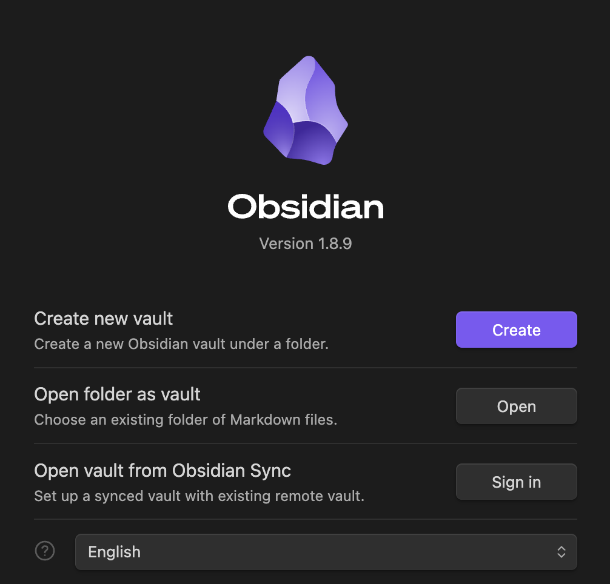

> [!WARNING] 
> This README is under construction 🚧

# How to start using this lab notebook 

1. Download [Obsidian](https://obsidian.md/)
2. Open your terminal in MacOS `Finder -> Applications -> Terminal`
3. Navigate to the **desired** home directory for your Lab Notebook (e.g. `cd /Users/elgin/Library/Documents/lab_notebooks`) 
4. `git clone https://github.com/elginakin/obsidian_academic_lab_notebook_template.git`
5. Open Obsidian 
6. Open the git repository folder as a vault 
	- 
7. Select the folder: obsidian_academic_lab_notebook_template 
	- 
8. Proceed with the notebook introduction! in the `_🎉 Welcome (Start Here`) folder. 

# Introduction

👋 Welcome! This repository contains a scaffolded digital laboratory notebook built in Obsidian. Its purpose is to provide academic users with a semi-automated approach to designing, executing, and recording experiments while simultaneously integrating findings from the literature—all in one centralized, local (on your native machine) workspace.
# Motivation

I am currently completing my PhD in Molecular Microbiology and Immunology at Johns Hopkins University. This notebook is the result of my insatiable need to over-structure my life while navigating academia. I grew tired of using multiple applications to track experiments and constantly found myself citing and summarizing literature in my old lab notebooks. The nature of my dissertation work has led to many projects opening, closing, and merging, requiring the parallel execution of numerous experiments.

A more serious motivation for this lab notebook is the widespread challenge of reproducibility in the biological sciences.[^1] While many contributing factors are conceptual, this notebook aims to address a practical one: reducing the time and effort required to document experimental design and results. In this new era of science, graduate students are generating more data than ever before. This is largely due to advancements in technology that allow us to extract more information from each experiment. While many Electronic Laboratory Notebook (ELN) solutions exist, I found that none fully met my specific needs.[^2]

> [!IMPORTANT]
> This vault and the instructions herein were assembled in a MacOS environment thus paths within core and community Obsidian plugins may need manual curation to operate as expected.

# This notebook relies on the following plugins for intended operation and use: 

The plugins below have been chosen to significantly enhance the experience of the academic user. However, these plugins are typically maintained by the community and may have diminishing community support over time. While the Obsidian community is strong through [Obsidian Forum](https://forum.obsidian.md/) 

## Core Plugins

Daily Notes

Templates

## Community Plugins

Auto Link Title 

Auto Note Mover

Automatic Table of Contents

Better Word Count

Calendar 

Dataview 

Excel to Markdown Table

Homepage

Iconize

Image Toolkit 

Minimal Theme Settings

Omnisearch

Pandoc Plugin

Pandoc Reference List

Periodic Notes

Quiet Outline

Settings Search

Tag Wrangler

Tasks

Templater

[^1]: [Six factors affecting reproducibility in life science research and how to handle them](https://www.nature.com/articles/d42473-019-00004-y#:~:text=The%20reproducibility%20problem,research%20is%20often%20not%20reproducible.)

[^2]: [Considerations for implementing electronic laboratory notebooks in an academic research environment \| Nature Protocols](https://www.nature.com/articles/s41596-021-00645-8)
